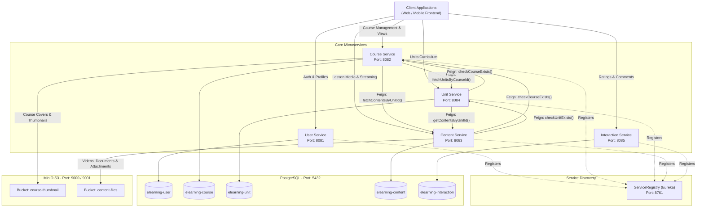
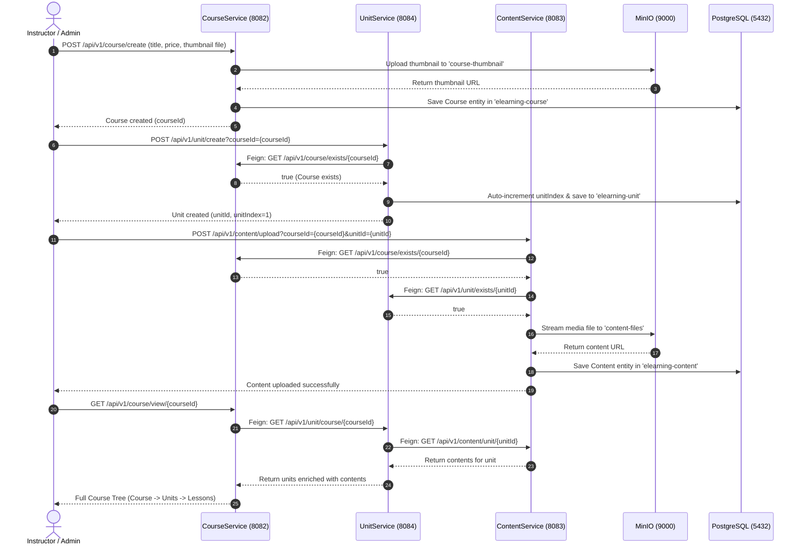

# E-Learning Platform &mdash; Backend Architecture & Documentation

A distributed, reactive, and cloud-native microservices backend for an enterprise E-Learning platform. Built with **Spring Boot 3.x / 4.x**, **Spring Cloud (Eureka & OpenFeign)**, **PostgreSQL (Database-per-Service)**, and **MinIO Object Storage (S3-Compatible)**.


> [!TIP]
> **Need to understand how Course &rarr; Units &rarr; Contents are fetched?**  
> Read the complete method-by-method execution trace, code walkthrough, and sequence diagrams in [**`COURSE_UNIT_CONTENT_WORKFLOW.md`**](file:///c:/Users/Debarghya2/Desktop/E_Learning_Microservices/COURSE_UNIT_CONTENT_WORKFLOW.md).

---

## Table of Contents

1. [System Architecture](#system-architecture)
2. [Microservices Overview](#microservices-overview)
3. [Service Discovery & Topology](#service-discovery--topology)
4. [Storage & Media Architecture](#storage--media-architecture)
5. [Prerequisites & Environment Setup](#prerequisites--environment-setup)
6. [Databases & Buckets Provisioning](#databases--buckets-provisioning)
7. [Startup Order & Execution Guide](#startup-order--execution-guide)
8. [Comprehensive API Reference](#comprehensive-api-reference)
   - [1. Service Registry (Eureka)](#1-service-registry-eureka)
   - [2. User Service](#2-user-service-port-8081)
   - [3. Course Service](#3-course-service-port-8082)
   - [4. Unit Service](#4-unit-service-port-8084)
   - [5. Content Service](#5-content-service-port-8083)
   - [6. Interaction Service](#6-interaction-service-port-8085)
9. [Inter-Service Communication Flow](#inter-service-communication-flow)
10. [Error Handling & Resilience](#error-handling--resilience)
11. [Testing & Verification](#testing--verification)

---

## System Architecture

The backend follows the **Database-per-Service** and **Centralized Service Registry** architectural patterns. Services encapsulate their own domain logic and data stores, communicating synchronously via **Spring Cloud OpenFeign** for cross-service validations and hierarchical data enrichment.



---

## Microservices Overview

| Microservice | Port | Database | Primary Responsibility | Key Integrations |
| :--- | :--- | :--- | :--- | :--- |
| **[ServiceRegistry](file:///c:/Users/Debarghya2/Desktop/E_Learning_Microservices/ServiceRegistry)** | `8761` | *None* | Central service registration, heartbeat monitoring, and instance lookup. | Spring Cloud Eureka Server |
| **[userservice](file:///c:/Users/Debarghya2/Desktop/E_Learning_Microservices/userservice)** | `8081` | `elearning-user` | User registration, authentication, role assignment (`USER`, `ADMIN`), and profile lookup. | Spring Data JPA, PostgreSQL |
| **[Courseservice](file:///c:/Users/Debarghya2/Desktop/E_Learning_Microservices/Courseservice)** | `8082` | `elearning-course` | Course lifecycle (`DRAFT`, `PUBLISHED`, `ARCHIVED`), metadata management, thumbnail storage, and hierarchical course-tree assembly. | OpenFeign (`UnitService`, `ContentService`), MinIO (`course-thumbnail`) |
| **[UnitService](file:///c:/Users/Debarghya2/Desktop/E_Learning_Microservices/UnitService)** | `8084` | `elearning-unit` | Course curriculum structuring, sequential auto-indexing (`unitIndex`), and unit content aggregation. | OpenFeign (`CourseService`, `ContentService`) |
| **[ContentService](file:///c:/Users/Debarghya2/Desktop/E_Learning_Microservices/ContentService)** | `8083` | `elearning-content` | Multipart lesson upload, video/document object storage, lesson duration tracking, and content queries. | OpenFeign (`CourseService`, `UnitService`), MinIO (`content-files`) |
| **[InteractionService](file:///c:/Users/Debarghya2/Desktop/E_Learning_Microservices/InteractionService)** | `8085` | `elearning-interaction` | Student-course engagement, comments, reviews, ratings, and course discussions. | OpenFeign, Spring Cloud Eureka Client, PostgreSQL / MongoDB |

---

## Service Discovery & Topology

- **Eureka Server URL**: `http://localhost:8761/`
- All client services automatically register under their designated `spring.application.name`:
  - `userservice`
  - `CourseService`
  - `UnitService`
  - `ContentService`
  - `InteractionService`
- **Browser Convenience**: `ServiceRegistry` includes `EurekaBrowserRedirectFilter` which automatically redirects browser visits from `/eureka` or `/eureka/` to the dashboard at `/`.

---

## Storage & Media Architecture

The system utilizes **MinIO** as an S3-compatible object storage server:
- **Default Endpoint**: `http://localhost:9000`
- **Web Console**: `http://localhost:9001`
- **Credentials**: `admin` / `admin12345` (or `minioadmin` / `minioadmin`)

### Storage Buckets

1. **`course-thumbnail`**:
   - Stores image thumbnails for courses (JPEG, PNG, WebP).
   - Managed by `CourseService`.
   - Accessible via direct presigned or public URL links stored in the `thumbnailUrl` field of the `Course` entity.
2. **`content-files`**:
   - Stores lesson media files, including lecture videos (MP4, MKV), PDF notes, and slides.
   - Managed by `ContentService`.
   - File key naming strategy: `{courseId}/{lessonIndex}-{originalFilename}` to ensure isolation and collision prevention.

---

## Prerequisites & Environment Setup

- **Java Development Kit (JDK)**: Version 22
- **Apache Maven**: Version 3.9+
- **PostgreSQL**: Version 15+ (Running on `localhost:5432`)
- **MinIO Object Storage**: Running on `localhost:9000`

---

## Databases & Buckets Provisioning

### 1. PostgreSQL Databases Creation
Execute the following commands in `psql` or pgAdmin:

```sql
CREATE DATABASE "elearning-user";
CREATE DATABASE "elearning-course";
CREATE DATABASE "elearning-unit";
CREATE DATABASE "elearning-content";
CREATE DATABASE "elearning-interaction";
```

> [!NOTE]
> All services have `spring.jpa.hibernate.ddl-auto: update` configured, so schemas, tables, and constraints will be generated automatically upon initial startup.

### 2. MinIO Buckets Provisioning
Using the MinIO Web Console (`http://localhost:9001`) or the MinIO Client (`mc`):

```bash
# Using MinIO Client CLI (mc)
mc alias set local http://localhost:9000 admin admin12345

mc mb local/course-thumbnail
mc mb local/content-files

# Set read access policy if direct thumbnail/content preview is required
mc anonymous set download local/course-thumbnail
mc anonymous set download local/content-files
```

---

## Startup Order & Execution Guide

> [!IMPORTANT]
> Always start **ServiceRegistry** first so other microservices can register and resolve Feign clients without startup latency.

### Order of Startup:
1. **ServiceRegistry** (`8761`)
2. **userservice** (`8081`)
3. **Courseservice** (`8082`)
4. **UnitService** (`8084`)
5. **ContentService** (`8083`)
6. **InteractionService** (`8085`)

### Running via Terminal / Maven:

```bash
# Terminal 1: Service Registry
cd ServiceRegistry
mvn spring-boot:run

# Terminal 2: User Service
cd userservice
mvn spring-boot:run

# Terminal 3: Course Service
cd Courseservice
mvn spring-boot:run

# Terminal 4: Unit Service
cd UnitService
mvn spring-boot:run

# Terminal 5: Content Service
cd ContentService
mvn spring-boot:run

# Terminal 6: Interaction Service
cd InteractionService
mvn spring-boot:run
```

### Running via VS Code / Antigravity IDE:
The repository includes launch definitions in [`.vscode/launch.json`](file:///c:/Users/Debarghya2/Desktop/E_Learning_Microservices/.vscode/launch.json). Navigate to the **Run & Debug** panel and launch:
- `Spring Boot-ServiceRegistryApplication<ServiceRegistry>`
- `Spring Boot-UserserviceApplication<userservice>`
- `Spring Boot-CourseServiceApplication<CourseService>`
- `Spring Boot-UnitServiceApplication<UnitService>`
- `Spring Boot-ContentServiceApplication<ContentService>`
- `Spring Boot-InteractionServiceApplication<InteractionService>`

---

## Comprehensive API Reference

### 1. Service Registry (Eureka)
- **Base URL**: `http://localhost:8761`
- **Dashboard**: `GET /`
- **Registry API**: `GET /eureka/apps`

---

### 2. User Service (Port 8081)
- **Base URL**: `http://localhost:8081/api/v1/users`

#### A. User Registration
- **Method**: `POST /api/v1/users/register`
- **Content-Type**: `application/json`
- **Request Body**:
  ```json
  {
    "firstName": "John",
    "lastName": "Doe",
    "email": "john.doe@example.com",
    "password": "password123",
    "confirmPassword": "password123"
  }
  ```
- **Response**: `200 OK`
  ```json
  {
    "success": true,
    "message": "User registered successfully",
    "registerAt": "2026-09-07T14:30:00"
  }
  ```

#### B. Fetch User Profile
- **Method**: `GET /api/v1/users/profile?userId=1`
- **Response**: `200 OK`
  ```json
  {
    "userId": 1,
    "firstname": "John",
    "lastname": "Doe",
    "email": "john.doe@example.com",
    "role": "USER"
  }
  ```

---

### 3. Course Service (Port 8082)
- **Base URL**: `http://localhost:8082/api/v1`

#### A. Create Course
- **Method**: `POST /api/v1/course/create`
- **Content-Type**: `multipart/form-data`
- **Form Fields**:
  - `title` (string, required): e.g. `"Mastering Microservices with Spring Boot"`
  - `description` (string, required): Detailed course summary
  - `category` (string, required): e.g. `"Backend Engineering"`
  - `courseLevel` (string, required): `"BEGINNER"` \| `"INTERMEDIATE"` \| `"ADVANCED"`
  - `price` (double, required): e.g. `49.99`
  - `thumbnail` (file, required): Course cover image
- **Response**: `201 Created`
  ```json
  {
    "success": true,
    "message": "Course created successfully",
    "course": {
      "courseId": "a1b2c3d4-e5f6-7890-abcd-ef1234567890",
      "title": "Mastering Microservices with Spring Boot",
      "description": "Comprehensive guide to microservices.",
      "category": "Backend Engineering",
      "courseLevel": "ADVANCED",
      "price": 49.99,
      "thumbnailUrl": "http://localhost:9000/course-thumbnail/uuid.jpg",
      "courseState": "DRAFT",
      "createdAt": "2026-09-07T14:00:00",
      "updatedAt": "2026-09-07T14:00:00"
    },
    "units": null
  }
  ```

#### B. List All Courses (With Units & Contents Enriched)
- **Method**: `GET /api/v1/course/list`
- **Description**: Returns all courses. Each course is enriched with its units (from `UnitService`) and all lesson contents for each unit (from `ContentService`).
- **Response**: `200 OK`

#### C. View Single Course Detail (Hierarchical Course Tree)
- **Method**: `GET /api/v1/course/{courseId}` or `GET /api/v1/course/view/{courseId}`
- **Response**: `200 OK`
  ```json
  {
    "success": true,
    "message": "Here is the list of units inside the course",
    "course": {
      "courseId": "a1b2c3d4-e5f6-7890-abcd-ef1234567890",
      "title": "Mastering Microservices with Spring Boot",
      "category": "Backend Engineering",
      "courseLevel": "ADVANCED",
      "price": 49.99,
      "thumbnailUrl": "http://localhost:9000/course-thumbnail/uuid.jpg",
      "courseState": "DRAFT"
    },
    "units": [
      {
        "unitId": "u1-uuid",
        "courseId": "a1b2c3d4-e5f6-7890-abcd-ef1234567890",
        "title": "Module 1: Service Discovery",
        "unitIndex": 1,
        "contents": [
          {
            "contentId": "c1-uuid",
            "lessonIndex": "1",
            "title": "Introduction to Eureka",
            "duration": 420,
            "contentUrl": "http://localhost:9000/content-files/..."
          }
        ]
      }
    ]
  }
  ```

#### D. Update Course
- **Method**: `PUT /api/v1/course/update/{courseId}`
- **Content-Type**: `multipart/form-data`
- **Form Fields**: `title`, `description`, `category`, `courseLevel`, `price`, and optional new `thumbnail` file.
- **Response**: `200 OK`

#### E. Course Existence Check (Internal Feign Endpoint)
- **Method**: `GET /api/v1/course/exists/{courseId}`
- **Response**: `200 OK` (`true` or `false`)

---

### 4. Unit Service (Port 8084)
- **Base URL**: `http://localhost:8084/api/v1/unit`

#### A. Create Unit (Supports JSON & Form-Data)
- **Method**: `POST /api/v1/unit/create?courseId={courseId}`
- **Option 1: JSON Payload** (`Content-Type: application/json`):
  ```json
  {
    "title": "Unit 1: Architecture Overview",
    "description": "Understanding microservices foundations"
  }
  ```
- **Option 2: Form-Data** (`Content-Type: multipart/form-data` or `application/x-www-form-urlencoded`):
  - Form field: `title`
  - Form field: `description`
  - Optional query parameter: `courseId` or form parameter: `courseId`
- **Behavior**:
  1. Validates that the specified `courseId` exists via `CourseService` Feign Client.
  2. Auto-calculates `unitIndex` (sequential ordering starting at `1`).
- **Response**: `201 Created`
  ```json
  {
    "success": true,
    "message": "Unit created successfully",
    "unit": {
      "unitId": "u1-uuid",
      "courseId": "a1b2c3d4-e5f6-7890-abcd-ef1234567890",
      "title": "Unit 1: Architecture Overview",
      "description": "Understanding microservices foundations",
      "unitIndex": 1,
      "createdAt": "2026-09-07T14:10:00",
      "updatedAt": "2026-09-07T14:10:00"
    }
  }
  ```

#### B. Get Units by Course ID
- **Method**: `GET /api/v1/unit/course/{courseId}`
- **Response**: `200 OK` (Array of `Unit` objects ordered by `unitIndex ASC`)

#### C. Unit Existence Check (Internal Feign Endpoint)
- **Method**: `GET /api/v1/unit/exists/{unitId}`
- **Response**: `200 OK` (`true` or `false`)

---

### 5. Content Service (Port 8083)
- **Base URL**: `http://localhost:8083/api/v1/content`

#### A. Upload Lesson Content & Media
- **Method**: `POST /api/v1/content/create` or `POST /api/v1/content/upload`
- **Query Parameters**:
  - `courseId` (required): UUID of the parent course
  - `unitId` (required): UUID of the parent unit
- **Content-Type**: `multipart/form-data`
- **Form Fields / Request**:
  - `lessonIndex` (string, required): e.g. `"1"` or `"1.1"`
  - `title` (string, required): Lesson headline
  - `description` (string, required): Summary of lesson material
  - `duration` (long, required): Video/lesson duration in seconds (e.g., `540`)
  - `file` (multipart file, required): Video or attachment file (also supports parameter aliases `files` or `content`)
  - *Alternative*: JSON string can be passed via form-part `request` or `data`.
- **Validation Flow**:
  1. Feign check to `CourseService`: ensures course is active and valid.
  2. Feign check to `UnitService`: ensures unit exists.
  3. Uploads file to MinIO `content-files` bucket.
  4. Stores record in PostgreSQL `contents` table.
- **Response**: `201 Created`
  ```json
  {
    "success": true,
    "message": "Content created successfully",
    "content": {
      "contentId": "c1-uuid",
      "courseId": "a1b2c3d4-e5f6-7890-abcd-ef1234567890",
      "unitId": "u1-uuid",
      "lessonIndex": "1",
      "title": "Eureka Architecture Deep Dive",
      "description": "Understanding heartbeat mechanisms and registry caches.",
      "duration": 540,
      "contentUrl": "http://localhost:9000/content-files/a1b2c3d4/1-video.mp4",
      "createdAt": "2026-09-07T14:20:00",
      "updatedAt": "2026-09-07T14:20:00"
    }
  }
  ```

#### B. Fetch Contents by Unit ID
- **Method**: `GET /api/v1/content/unit/{unitId}`
- **Response**: `200 OK` (Array of `Content` objects ordered by `lessonIndex ASC`)

---

### 6. Interaction Service (Port 8085)
- **Base URL**: `http://localhost:8085/api/v1/interaction`

#### A. Service Status & Health
- **Method**: `GET /api/v1/interaction/status`
- **Response**: `200 OK`
  ```json
  {
    "service": "InteractionService",
    "status": "UP",
    "port": 8085,
    "timestamp": "2026-09-08T05:10:00Z",
    "registeredWithEureka": true
  }
  ```

---

## Inter-Service Communication Flow

### Course Creation with Curriculum & Lessons Flow



---

## Error Handling & Resilience

1. **Global Exception Handling**:
   - Every service is equipped with a `@RestControllerAdvice` (`GlobalExceptionHandler`) translating validation failures, entity not found errors, and Feign communication issues into clean, predictable JSON responses.
2. **Feign Client Fallbacks**:
   - `CourseService` includes `UnitClientFallback` to gracefully return an empty list or cached state if `UnitService` is temporarily unavailable or undergoing maintenance.
3. **Multipart Request Optimization**:
   - `ContentService` and `CourseService` are tuned with high throughput limits (`max-file-size: 2048MB`, `max-request-size: 2048MB`, and `max-swallow-size: -1`) to permit large high-definition video uploads without socket disconnection.
4. **Validation Constraints**:
   - Jakarta Bean Validation (`@Valid`, `@NotNull`, `@NotBlank`, `@Size`, `@Email`) is enforced at the controller boundary.

---

## Testing & Verification

Each service includes isolated unit and integration test suites:

```bash
# Run tests across all microservices
mvn test

# Run tests for a specific microservice
mvn -pl UnitService test
mvn -pl ContentService test
mvn -pl Courseservice test
mvn -pl userservice test
```

### Test Coverage Highlights:
- **`UnitServiceImplTest`**: Verifies auto-indexing logic, course existence validation, and Feign fallback handling.
- **`ContentServiceImplTest`**: Mocks MinIO client interactions and verifies cross-service validations with `CourseService` and `UnitService`.
