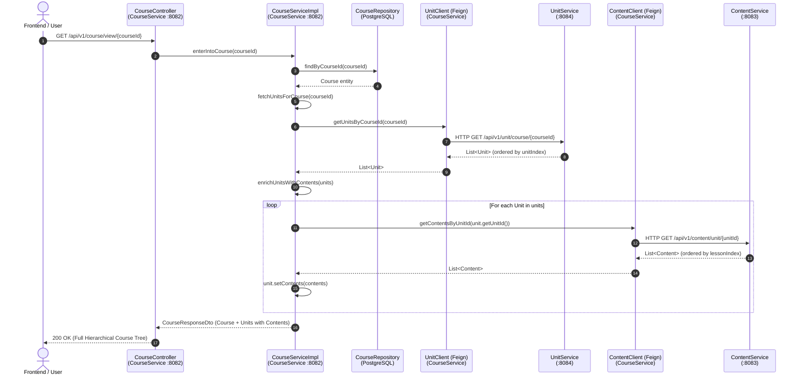
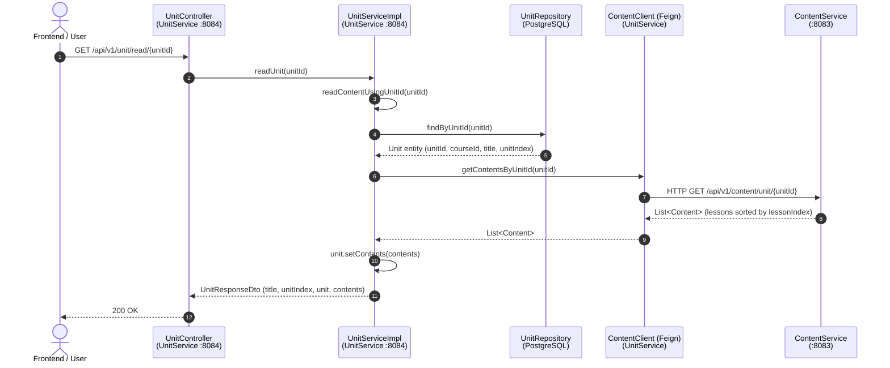

# Course &rarr; Unit &rarr; Content Workflow & Execution Guide

This document explains the end-to-end method execution flow, inter-service communication, and data enrichment patterns across **CourseService**, **UnitService**, and **ContentService**.

---

## Table of Contents

1. [High-Level Architectural Concept](#high-level-architectural-concept)
2. [Data Model Hierarchy & Storage Separation](#data-model-hierarchy--storage-separation)
3. [Workflow 1: Opening a Course (Fetching Course &rarr; Units &rarr; Contents)](#workflow-1-opening-a-course-fetching-course--units--contents)
   - [Method Execution Trace](#method-execution-trace-workflow-1)
   - [Sequence Diagram](#sequence-diagram-workflow-1)
   - [Step-by-Step Code Walkthrough](#step-by-step-code-walkthrough-workflow-1)
4. [Workflow 2: Opening a Unit (Fetching Unit &rarr; Related Contents)](#workflow-2-opening-a-unit-fetching-unit--related-contents)
   - [Method Execution Trace](#method-execution-trace-workflow-2)
   - [Sequence Diagram](#sequence-diagram-workflow-2)
   - [Step-by-Step Code Walkthrough](#step-by-step-code-walkthrough-workflow-2)
5. [Workflow 3: Direct Content Fetching](#workflow-3-direct-content-fetching)
6. [Key Design Highlights & Why It Works](#key-design-highlights--why-it-works)

---

## High-Level Architectural Concept

In this microservices architecture, data is strictly isolated into separate databases according to the **Database-per-Service** pattern:

| Microservice | Port | Database | Entity Owned |
| :--- | :--- | :--- | :--- |
| **CourseService** | `8082` | `elearning-course` | `Course` (metadata, price, thumbnail) |
| **UnitService** | `8084` | `elearning-unit` | `Unit` (curriculum modules, `unitIndex`) |
| **ContentService** | `8083` | `elearning-content` | `Content` (lessons, video URL, duration) |

Because each microservice has its own independent database, `Course` does not have a database foreign-key join to `Unit`, and `Unit` does not have a database foreign-key join to `Content`.

Instead, **hierarchical data is stitched together at runtime using declarative Spring Cloud OpenFeign HTTP clients**.

```
[ Client / Frontend ]
         │
         ▼
┌─────────────────┐       OpenFeign        ┌─────────────────┐       OpenFeign        ┌─────────────────┐
│  CourseService  │ ─────────────────────> │   UnitService   │ ─────────────────────> │ ContentService  │
│   (Port 8082)   │   GET /unit/course/id  │   (Port 8084)   │   GET /content/unit/id │   (Port 8083)   │
└─────────────────┘                        └─────────────────┘                        └─────────────────┘
         │                                          │                                          │
         ▼                                          ▼                                          ▼
   PostgreSQL:                                PostgreSQL:                                PostgreSQL:
 [elearning-course]                         [elearning-unit]                          [elearning-content]
```

---

## Data Model Hierarchy & Storage Separation

### 1. Course (`Course.java` in CourseService)
- Stored in PostgreSQL `courses` table.
- Contains: `courseId`, `title`, `description`, `price`, `thumbnailUrl`, `courseState`.

### 2. Unit DTO (`Unit.java` in CourseService & UnitService)
- Stored in PostgreSQL `units` table (UnitService only).
- Contains: `unitId`, `courseId`, `title`, `description`, `unitIndex`.
- **Special Field**:
  ```java
  @Transient // In UnitService (not saved to PostgreSQL)
  private List<Content> contents;
  ```
  `contents` is populated dynamically in-memory via OpenFeign from `ContentService`.

### 3. Content (`Content.java` in ContentService)
- Stored in PostgreSQL `contents` table.
- Contains: `contentId`, `courseId`, `unitId`, `lessonIndex`, `title`, `description`, `duration`, `contentUrl`.

---

## Workflow 1: Opening a Course (Fetching Course &rarr; Units &rarr; Contents)

When a user clicks on a course card to view the entire course syllabus, lectures, and lessons, this workflow executes.

### Method Execution Trace (Workflow 1)

```
1. Client sends GET http://localhost:8082/api/v1/course/view/{courseId}
   └─► CourseController.enterIntoCourse(courseId)
       └─► CourseServiceImpl.enterIntoCourse(courseId)
           ├─► CourseRepository.findByCourseId(courseId)  ── [Query DB: elearning-course]
           └─► CourseServiceImpl.fetchUnitsForCourse(courseId)
               ├─► UnitClient.getUnitsByCourseId(courseId) ── [Feign HTTP GET to UnitService:8084]
               │   └─► UnitController.getUnitsByCourseId(courseId)
               │       └─► UnitServiceImpl.getUnitsByCourseId(courseId)
               │           └─► UnitRepository.findByCourseIdOrderByUnitIndexAsc(...) ── [Query DB: elearning-unit]
               └─► CourseServiceImpl.enrichUnitsWithContents(units)
                   └─► For each unit:
                       └─► ContentClient.getContentsByUnitId(unit.getUnitId()) ── [Feign HTTP GET to ContentService:8083]
                           └─► ContentController.getContentsByUnitId(unitId)
                               └─► ContentServiceImpl.getContentsByUnitId(unitId)
                                   └─► ContentRepository.findByUnitIdOrderByLessonIndexAsc(...) ── [Query DB: elearning-content]
           └─► Assembles CourseResponseDto (Course + List<Unit[contents]>)
   ◄─ Return 200 OK with full Course Tree
```

### Sequence Diagram (Workflow 1)



### Step-by-Step Code Walkthrough (Workflow 1)

#### 1. In `CourseController.java` (`CourseService`)
```java
@GetMapping({"/course/view/{courseId}", "/course/{courseId}"})
public ResponseEntity<CourseResponseDto> enterIntoCourse(@PathVariable String courseId) {
    CourseResponseDto response = courseService.enterIntoCourse(courseId);
    return ResponseEntity.status(HttpStatus.OK).body(response);
}
```

#### 2. In `CourseServiceImpl.java` (`CourseService`)
```java
@Override
public CourseResponseDto enterIntoCourse(String courseId) {
    // 1. Verify existence & fetch course entity
    if (!findCourseId(courseId)) {
        throw new RuntimeException("Course not found with id " + courseId);
    }
    Course course = courseRepository.findByCourseId(courseId);

    // 2. Fetch all units for this course (enriched with contents)
    List<Unit> units = fetchUnitsForCourse(courseId);

    // 3. Assemble and return composite response
    return CourseResponseDto.builder()
            .success(true)
            .message("Here is the list of units inside the course")
            .course(course)
            .units(units)
            .build();
}
```

#### 3. Fetching Units from `UnitClient`
```java
private List<Unit> fetchUnitsForCourse(String courseId) {
    List<Unit> units = Collections.emptyList();
    try {
        // Feign call to UnitService (http://localhost:8084/api/v1/unit/course/{courseId})
        List<Unit> fetchedUnits = unitClient.getUnitsByCourseId(courseId);
        if (fetchedUnits != null) {
            units = enrichUnitsWithContents(fetchedUnits);
        }
    } catch (Exception e) {
        System.err.println("Failed to fetch units from UnitClient: " + e.getMessage());
    }
    return units;
}
```

#### 4. Enriching Each Unit with Lessons from `ContentClient`
```java
private List<Unit> enrichUnitsWithContents(List<Unit> units) {
    if (units == null) return Collections.emptyList();

    for (Unit unit : units) {
        if (unit.getContents() == null || unit.getContents().isEmpty()) {
            try {
                // Feign call to ContentService (http://localhost:8083/api/v1/content/unit/{unitId})
                List<Content> contents = contentClient.getContentsByUnitId(unit.getUnitId());
                unit.setContents(contents != null ? contents : Collections.emptyList());
            } catch (Exception e) {
                unit.setContents(Collections.emptyList());
            }
        }
    }
    return units;
}
```

---

## Workflow 2: Opening a Unit (Fetching Unit &rarr; Related Contents)

When a user clicks on an individual unit/module inside a course or navigates directly to a unit viewer page, this workflow executes.

### Method Execution Trace (Workflow 2)

```
1. Client sends GET http://localhost:8084/api/v1/unit/read/{unitId}
   └─► UnitController.readUnit(unitId)
       └─► UnitServiceImpl.readUnit(unitId)
           └─► UnitServiceImpl.readContentUsingUnitId(unitId)
               ├─► UnitRepository.findByUnitId(unitId)  ── [Query DB: elearning-unit]
               ├─► ContentClient.getContentsByUnitId(unitId) ── [Feign HTTP GET to ContentService:8083]
               │   └─► ContentController.getContentsByUnitId(unitId)
               │       └─► ContentServiceImpl.getContentsByUnitId(unitId)
               │           └─► ContentRepository.findByUnitIdOrderByLessonIndexAsc(...) ── [Query DB: elearning-content]
               ├─► unit.setContents(contents)  ── [In-Memory transient assignment]
               └─► Assembles UnitResponseDto (Unit metadata + contents list)
   ◄─ Return 200 OK with Unit details & its lesson contents
```

### Sequence Diagram (Workflow 2)



### Step-by-Step Code Walkthrough (Workflow 2)

#### 1. In `UnitController.java` (`UnitService`)
```java
@GetMapping({"/read/{unitId}", "/view/{unitId}"})
public ResponseEntity<UnitResponseDto> readUnit(@PathVariable String unitId) {
    UnitResponseDto response = unitService.readUnit(unitId);
    return ResponseEntity.ok(response);
}
```

#### 2. In `UnitServiceImpl.java` (`UnitService`)
```java
@Override
public UnitResponseDto readUnit(String unitId) {
    return readContentUsingUnitId(unitId);
}

@Override
public UnitResponseDto readContentUsingUnitId(String unitId) {
    if (unitId == null || unitId.isBlank()) {
        throw new IllegalArgumentException("Unit ID is required");
    }

    // 1. Fetch unit from database
    Unit unit = unitRepository.findByUnitId(unitId.trim())
            .orElseThrow(() -> new RuntimeException("Unit not found with id " + unitId));

    // 2. Fetch contents for this unit via OpenFeign client
    List<Content> contents = Collections.emptyList();
    try {
        List<Content> fetchedContents = contentClient.getContentsByUnitId(unitId.trim());
        if (fetchedContents != null) {
            contents = fetchedContents;
        }
    } catch (Exception e) {
        log.warn("Failed to fetch contents for unit {}: {}", unitId, e.getMessage());
    }

    // 3. Set transient field on Unit
    unit.setContents(contents);

    // 4. Return enriched UnitResponseDto
    return UnitResponseDto.builder()
            .success(true)
            .message("Unit content fetched successfully")
            .title(unit.getTitle())
            .description(unit.getDescription())
            .unitIndex(unit.getUnitIndex())
            .unit(unit)
            .contents(contents)
            .build();
}
```

#### 3. OpenFeign Declaration in `ContentClient.java` (`UnitService`)
```java
@FeignClient(name = "ContentService", url = "${contentservice.url:http://localhost:8083}")
public interface ContentClient {

    @GetMapping("/api/v1/content/unit/{unitId}")
    List<Content> getContentsByUnitId(@PathVariable("unitId") String unitId);

}
```

---

## Workflow 3: Direct Content Fetching

When `ContentService` receives a request for a unit's contents (either from the browser, or via Feign from `CourseService` or `UnitService`), here is how it queries and returns data:

#### In `ContentController.java` (`ContentService`)
```java
@GetMapping({"/unit/{unitId}", "/unit/view/{unitId}", "/unit/{unitId}/contents"})
public ResponseEntity<List<Content>> getContentsByUnitId(@PathVariable String unitId) {
    List<Content> response = contentService.getContentsByUnitId(unitId);
    return ResponseEntity.status(HttpStatus.OK).body(response);
}
```

#### In `ContentServiceImpl.java` (`ContentService`)
```java
@Override
public List<Content> getContentsByUnitId(String unitId) {
    if (unitId == null || unitId.isBlank()) {
        throw new IllegalArgumentException("Unit ID is required");
    }
    // Returns contents sorted sequentially by lessonIndex (1, 2, 3...)
    return contentRepository.findByUnitIdOrderByLessonIndexAsc(unitId.trim());
}
```

---

## Key Design Highlights & Why It Works

1. **Clean Separation of Concerns**:
   - `CourseService` only manages courses.
   - `UnitService` only manages curriculum chapters and ordering.
   - `ContentService` manages media uploads, streaming URLs, and duration.

2. **Sequential Ordering Guarantee**:
   - Units are always returned sorted by `unitIndex ASC` (Module 1, Module 2, Module 3...).
   - Contents/lessons are always returned sorted by `lessonIndex ASC` (Lesson 1, Lesson 2, Lesson 3...).

3. **No Database Monolith**:
   - If `ContentService` undergoes maintenance or fails temporarily, `CourseService` and `UnitService` still return the courses and units smoothly (with an empty `contents` list rather than crashing the entire response), thanks to the `try-catch` and fallback design.

4. **Zero Frontend Complexity**:
   - The frontend does not need to make 50 separate API calls to piece together a course page. Calling `GET /api/v1/course/view/{courseId}` returns the complete nested hierarchy in one single JSON payload.
