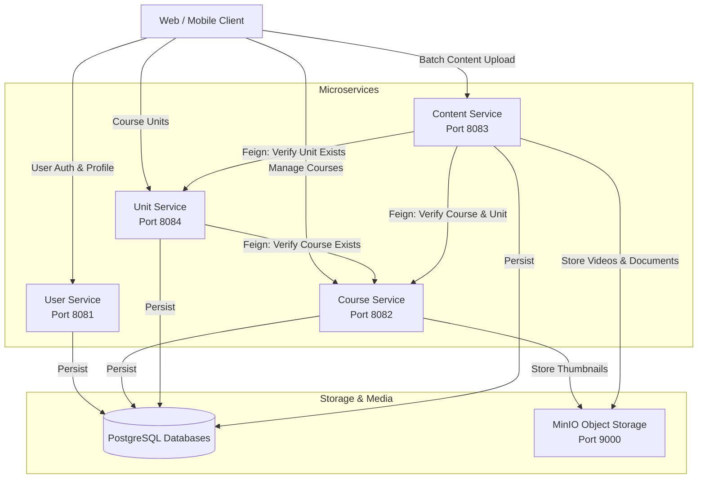

# E-Learning Microservices Platform

A scalable, distributed, and cloud-ready E-Learning backend platform built with **Spring Boot**, **Spring Cloud OpenFeign**, **PostgreSQL**, and **MinIO Object Storage**.

---

## Architecture Overview

The system is organized as a multi-module Maven project where each microservice owns its domain and database, communicating synchronously via OpenFeign clients for cross-service validation.



---

## Services & Ports Summary

| Service | Port | Database | Primary Purpose | Storage / Integrations |
| :--- | :--- | :--- | :--- | :--- |
| **userservice** | `8081` | `elearning-user` | User profiles, authentication, instructor & student accounts | PostgreSQL |
| **Courseservice** | `8082` | `elearning-course` | Course creation, management, category & level taxonomy | MinIO bucket: `course-thumbnail` |
| **UnitService** | `8084` | `elearning-unit` | Course curriculum structuring, auto-incremented unit indices | Feign Client &rarr; `CourseService` |
| **ContentService** | `8083` | `elearning-content` | Multi-file batch uploads, lessons, videos & reading materials | MinIO bucket: `content-files`, Feign &rarr; Course/Unit |

---

## Technology Stack

- **Java**: 22
- **Framework**: Spring Boot 4.x / Spring Cloud 2025.x
- **Inter-Service Communication**: Spring Cloud OpenFeign
- **ORM & Data**: Spring Data JPA, Hibernate, PostgreSQL
- **Object Storage**: MinIO Java SDK (S3 compatible)
- **Validation**: Jakarta Validation API
- **Build Tool**: Apache Maven (Aggregator Multi-Module Project)
- **Testing**: JUnit 5, Mockito

---

## Key Features & Design Highlights

1. **Decoupled Architecture**:
   - Each service has an independent PostgreSQL database (`elearning-user`, `elearning-course`, `elearning-unit`, `elearning-content`).
   - Clean boundaries and clear DTO separation.

2. **Course Hierarchy & Automated Indexing**:
   - `UnitService` assigns `unitIndex` automatically using sequential course-level auto-incrementing with collision handling.
   - `courseId` is provided strictly as a request parameter for clear REST semantics.

3. **High-Performance Content Batch Uploading**:
   - `ContentService` handles multipart batch uploads (`POST /api/v1/content/upload?courseId=...&unitId=...`).
   - Injects files sequentially into lesson metadata.
   - Asynchronously streams media files to MinIO object storage with automatic rollback and cleanup on persistence failures.
   - Verifies course and unit existence across microservices using declarative Feign clients.

---

## Core API Endpoints

### 1. Course Service (`http://localhost:8082`)
- `POST /courses/create` &mdash; Create a new course (with optional thumbnail multipart file).
- `GET /courses/exists/{courseId}` &mdash; Internal check for course existence.
- `GET /courses/all` &mdash; Retrieve all courses.
- `GET /courses/{id}` &mdash; Retrieve a course by ID.

### 2. Unit Service (`http://localhost:8084`)
- `POST /api/v1/unit/create?courseId={courseId}` &mdash; Create a unit within a course (auto-indexes).
- `GET /api/v1/unit/{unitId}` &mdash; Retrieve unit details.
- `GET /api/v1/unit/course/{courseId}` &mdash; Retrieve all units for a course in ascending order.
- `GET /api/v1/unit/exists/{unitId}` &mdash; Internal check for unit existence.

### 3. Content Service (`http://localhost:8083`)
- `POST /api/v1/content/upload?courseId={courseId}&unitId={unitId}` &mdash; Multipart batch content upload:
  - Form Fields: `contents[0].lessonIndex`, `contents[0].title`, `contents[0].duration`, etc.
  - Form Files: `files` (array of multipart media files mapped to content items).

### 4. User Service (`http://localhost:8081`)
- User creation and profile management endpoints.

---

## Prerequisites

- **Java JDK 22** or higher installed.
- **Apache Maven 3.9+** installed.
- **PostgreSQL 15+** running locally on port `5432`.
- **MinIO Object Storage** running locally on port `9000` (Console: `http://localhost:9001`).

---

## Local Development Setup

### 1. Databases Setup
Create the required PostgreSQL databases:
```sql
CREATE DATABASE "elearning-user";
CREATE DATABASE "elearning-course";
CREATE DATABASE "elearning-unit";
CREATE DATABASE "elearning-content";
```

### 2. MinIO Buckets Setup
Ensure MinIO is running and create the default buckets:
- `course-thumbnail`
- `content-files`

### 3. Build All Services
From the root directory:
```bash
mvn clean install -DskipTests
```

### 4. Run Services
You can run services individually using Maven or your IDE:

```bash
# Run User Service
cd userservice && mvn spring-boot:run

# Run Course Service
cd Courseservice && mvn spring-boot:run

# Run Unit Service
cd UnitService && mvn spring-boot:run

# Run Content Service
cd ContentService && mvn spring-boot:run
```

Alternatively, launch configurations are provided in `.vscode/launch.json` for one-click startup in VS Code / Antigravity IDE.

---

## Testing

Run unit and integration tests across all microservices:
```bash
mvn test
```

---

## License

This project is licensed under the MIT License.
