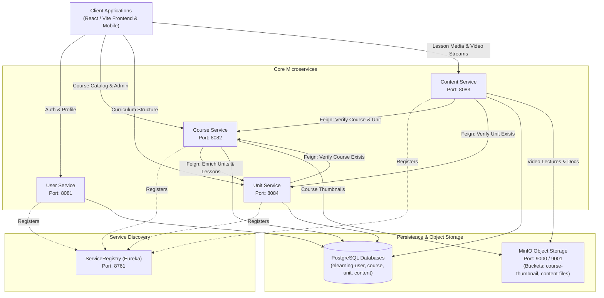

# E-Learning Microservices Platform

A scalable, distributed, and cloud-native E-Learning platform built with **Spring Boot 3.x / 4.x**, **Spring Cloud Netflix Eureka**, **Spring Cloud OpenFeign**, **PostgreSQL**, **MinIO Object Storage**, and **React / Vite**.

> [!TIP]
> For complete backend architectural deep-dives, database schemas, Feign communication topologies, and exhaustive API reference tables, see [**BACKEND_README.md**](file:///c:/Users/Debarghya2/Desktop/E_Learning_Microservices/BACKEND_README.md).  
> For the step-by-step method workflow of how Courses fetch Units and Units fetch Contents, see [**COURSE_UNIT_CONTENT_WORKFLOW.md**](file:///c:/Users/Debarghya2/Desktop/E_Learning_Microservices/COURSE_UNIT_CONTENT_WORKFLOW.md).  
> For frontend setup and UI components, see [**frontend/README.md**](file:///c:/Users/Debarghya2/Desktop/E_Learning_Microservices/frontend/README.md).

---

## Architecture Overview

The system is organized as a multi-module Maven project where each microservice owns its domain and database, registered under a central **Netflix Eureka Service Registry** and communicating synchronously via **OpenFeign** clients.



---

## Services & Ports Summary

| Service | Port | Database | Primary Purpose | Storage & Integrations |
| :--- | :--- | :--- | :--- | :--- |
| **[ServiceRegistry](file:///c:/Users/Debarghya2/Desktop/E_Learning_Microservices/ServiceRegistry)** | `8761` | *None* | Central service registration and discovery | Eureka Server, Web Dashboard |
| **[userservice](file:///c:/Users/Debarghya2/Desktop/E_Learning_Microservices/userservice)** | `8081` | `elearning-user` | User authentication, registration, profiles, roles | PostgreSQL, Spring Data JPA |
| **[Courseservice](file:///c:/Users/Debarghya2/Desktop/E_Learning_Microservices/Courseservice)** | `8082` | `elearning-course` | Course creation, management, taxonomy, hierarchical course-tree | MinIO (`course-thumbnail`), Feign &rarr; Unit & Content |
| **[UnitService](file:///c:/Users/Debarghya2/Desktop/E_Learning_Microservices/UnitService)** | `8084` | `elearning-unit` | Course curriculum structuring, auto-incrementing unit index | Feign &rarr; Course & Content |
| **[ContentService](file:///c:/Users/Debarghya2/Desktop/E_Learning_Microservices/ContentService)** | `8083` | `elearning-content` | Multipart lesson uploads, video files, reading materials | MinIO (`content-files`), Feign &rarr; Course & Unit |
| **[frontend](file:///c:/Users/Debarghya2/Desktop/E_Learning_Microservices/frontend)** | `5173` | *None* | Modern interactive web UI | React 19, Vite, Lucide Icons |

---

## Technology Stack

- **Java**: 22
- **Framework**: Spring Boot 3.x / 4.x & Spring Cloud 2025.x
- **Service Discovery**: Spring Cloud Netflix Eureka Server / Client
- **Inter-Service Communication**: Spring Cloud OpenFeign
- **ORM & Persistence**: Spring Data JPA, Hibernate, PostgreSQL
- **Object Storage**: MinIO Java SDK (S3-compatible)
- **Validation**: Jakarta Validation API
- **Build Tool**: Apache Maven (Multi-Module Aggregator)
- **Frontend**: React 19, Vite

---

## Quick Start & Local Setup

### 1. PostgreSQL Databases Setup
Ensure PostgreSQL is running locally on port `5432` and create the required databases:

```sql
CREATE DATABASE "elearning-user";
CREATE DATABASE "elearning-course";
CREATE DATABASE "elearning-unit";
CREATE DATABASE "elearning-content";
```

### 2. MinIO Buckets Setup
Ensure MinIO is running on port `9000` (Console on `9001`) and create the storage buckets:
- `course-thumbnail`
- `content-files`

### 3. Build All Microservices
From the root directory:
```bash
mvn clean install -DskipTests
```

### 4. Start Services (Recommended Order)
Always start **ServiceRegistry** first:

```bash
# 1. Service Registry (Eureka Dashboard: http://localhost:8761)
cd ServiceRegistry && mvn spring-boot:run

# 2. User Service (Port 8081)
cd userservice && mvn spring-boot:run

# 3. Course Service (Port 8082)
cd Courseservice && mvn spring-boot:run

# 4. Unit Service (Port 8084)
cd UnitService && mvn spring-boot:run

# 5. Content Service (Port 8083)
cd ContentService && mvn spring-boot:run
```

*Note: One-click debug profiles are also available in [`.vscode/launch.json`](file:///c:/Users/Debarghya2/Desktop/E_Learning_Microservices/.vscode/launch.json).*

---

## Core API Endpoints Quick Reference

### Service Registry (`http://localhost:8761`)
- `GET /` &mdash; Eureka Web Dashboard

### User Service (`http://localhost:8081`)
- `POST /api/v1/users/register` &mdash; Register a new user
- `GET /api/v1/users/profile?userId={id}` &mdash; Fetch user profile

### Course Service (`http://localhost:8082`)
- `POST /api/v1/course/create` &mdash; Create course with thumbnail (`multipart/form-data`)
- `GET /api/v1/course/list` &mdash; List all courses (enriched with units & lessons)
- `GET /api/v1/course/view/{courseId}` &mdash; Enter into course (full hierarchical tree: Course &rarr; Units &rarr; Contents)
- `PUT /api/v1/course/update/{courseId}` &mdash; Update course metadata & thumbnail
- `GET /api/v1/course/exists/{courseId}` &mdash; Internal check for course existence

### Unit Service (`http://localhost:8084`)
- `POST /api/v1/unit/create?courseId={courseId}` &mdash; Create unit within a course (auto-indexed)
- `GET /api/v1/unit/course/{courseId}` &mdash; Get all units for a course
- `GET /api/v1/unit/exists/{unitId}` &mdash; Internal check for unit existence

### Content Service (`http://localhost:8083`)
- `POST /api/v1/content/upload?courseId={courseId}&unitId={unitId}` &mdash; Upload lesson media (`multipart/form-data`)
- `POST /api/v1/content/create?courseId={courseId}&unitId={unitId}` &mdash; Create lesson content
- `GET /api/v1/content/unit/{unitId}` &mdash; Get all lessons in a unit (ordered by lessonIndex)

---

## Documentation

- Detailed Backend Guide: [**BACKEND_README.md**](file:///c:/Users/Debarghya2/Desktop/E_Learning_Microservices/BACKEND_README.md)
- Frontend Guide: [**frontend/README.md**](file:///c:/Users/Debarghya2/Desktop/E_Learning_Microservices/frontend/README.md)

---

## License

This project is licensed under the MIT License.
